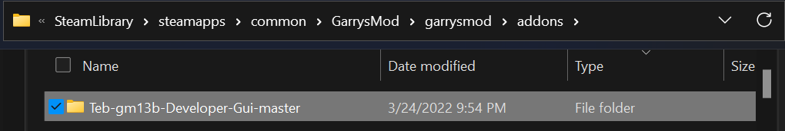
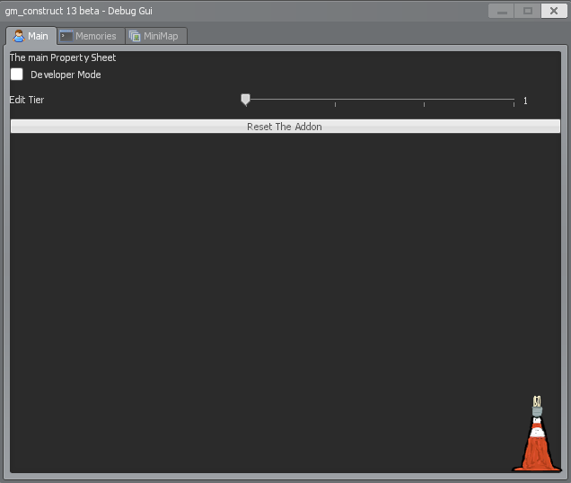
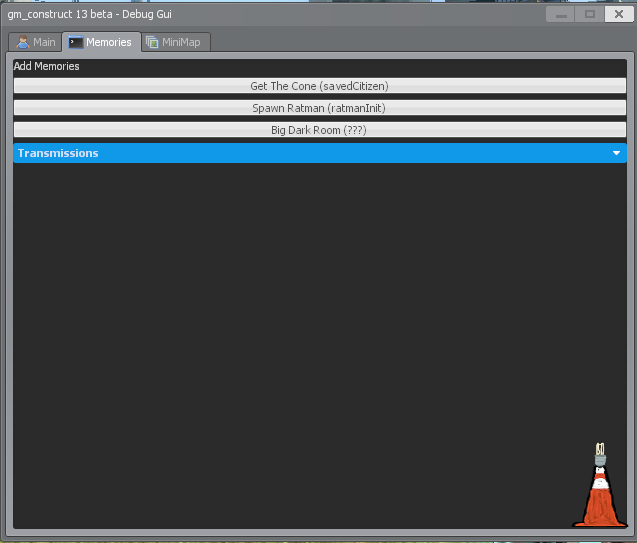
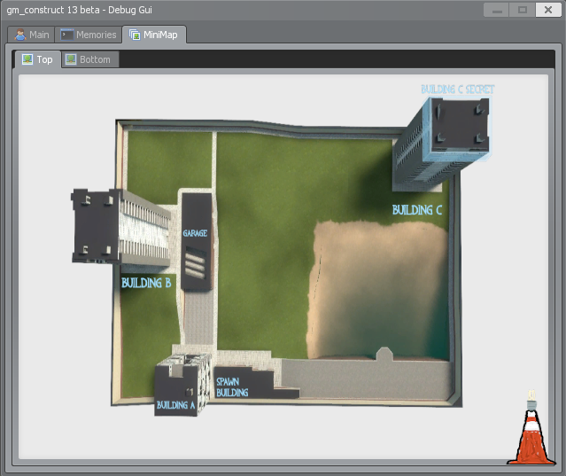

# TheEndBoss_101's gm_construct 13 beta Dev VGUI

A simple developer gui.

# How to set up the addon

The only thing you need to do is clone the repository inside GMod addons folder and keep the directory names. Like so.

<figure>
    
    <figcaption>The Addons Folder</figcaption>
</figure>

<!--
# Images

<figure>
    
    <figcaption>The Main Tab</figcaption>
</figure>
<figure>
    
    <figcaption>The Memories Tab</figcaption>
</figure>
<figure>
    
    <figcaption>The Map Tab Top</figcaption>
</figure>
<figure>
    
    <figcaption>The Map Tab Bottom</figcaption>
</figure>
<figure>
    
    <figcaption>The Addons Folder</figcaption>
</figure>
-->

# Q & A / FAQ

> Q: How do i download?  
> A: Click code and download as a .zip

> Q: What addon folder?  
> A: C:\Program Files (x86)\Steam\steamapps\common\GarrysMod\garrysmod\addons

> Q: What do you mean by unzip?  
> A: What?

> Q: Where can I make a bug report?  
> A: [Here](https://github.com/TheEndBoss-101/Teb-gm13b-Developer-Gui/issues)

# Links

[gm_construct_13 beta](https://steamcommunity.com/sharedfiles/filedetails/?id=2553727051)

[AMTF map Wiki](https://gmconstruct-13-beta.fandom.com/wiki/Gm_construct_13_beta_Wiki)

[ARC Discord](https://discord.gg/97UpY3D7XB)

[AMTF Discord](https://discord.gg/dw3rVqMhr7)

# License

MIT License
